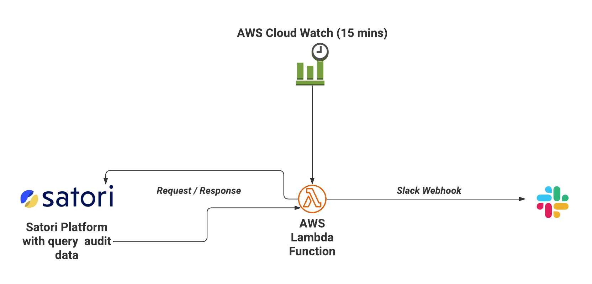
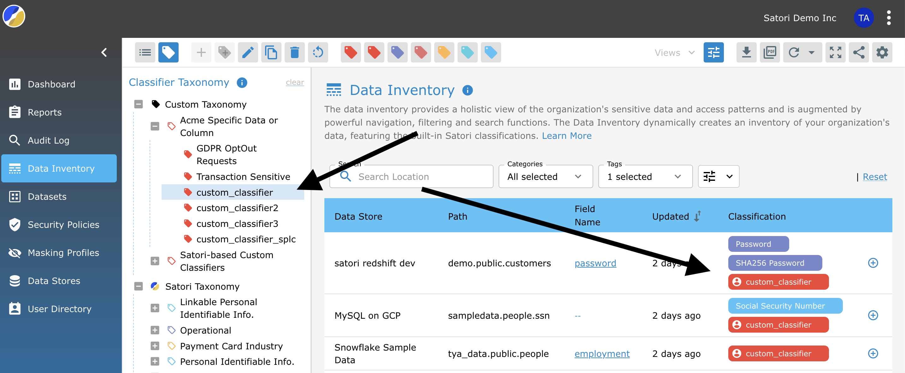
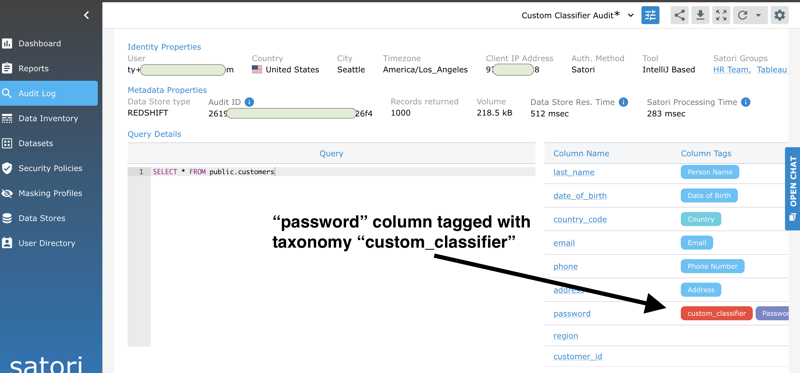
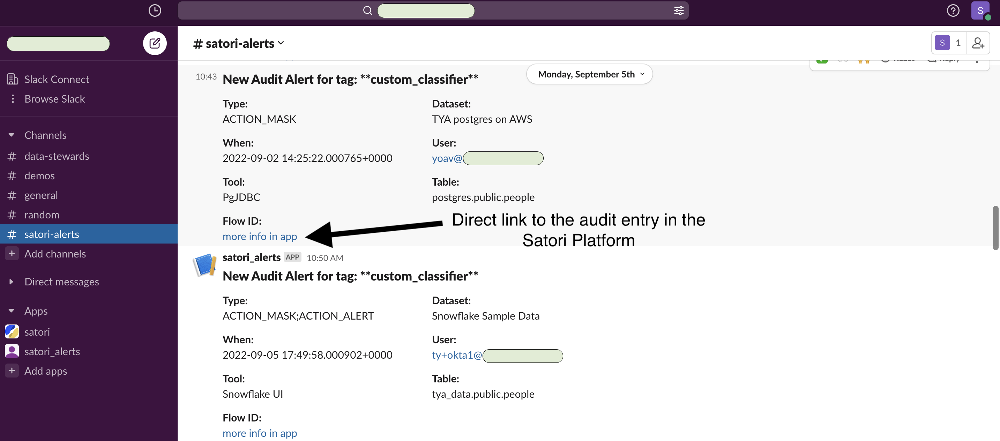

## Satori Slack Alert Example

### An AWS Lambda function that retrieves Satori audit info using the Satori Rest API, matching on certain taxonomies/tags for the last 15 minutes, and posting those results to a Slack channel via a Slack webhook.

**Summary**

This is a terraform config project which deploys the following resources to AWS:

- IAM/Policy/Role info.
- An AWS [Lambda](https://aws.amazon.com/lambda/) function which bridges [Satori](https://www.satoricyber.com/docs/getting-started/) and [Slack](https://api.slack.com/messaging/webhooks).
- An AWS [Cloudwatch](https://aws.amazon.com/cloudwatch/) rule to poll the Lambda function every 15 minutes.



___

#### Requirements


- You need to have [terraform](https://www.terraform.io/downloads) installed.
- You need to be, or work with, an admin for Slack. This person will create a [Slack webhook](https://api.slack.com/messaging/webhooks) associated with a Slack channel.
	- _Note: A Slack webhook is considered secret and sensitive, please use and implement accordingly._
- You need a [Satori account](https://satoricyber.com/testdrive/) and admin access to that account. You will need 
	- The ```Account ID``` available in _Settings>>Account Settings_, and 
	- A created [Satori service account](https://www.satoricyber.com/docs/console/users-and-roles/#service-accounts), which results in a ```Service Account ID``` and ```Service Account Key```.
- And lastly for AWS, you need to have permissions to create resources. This terraform config creates basic security using the file [iam.tf](iam.tf) - you may need to change settings in this file, specific to your environment.

#### Setup

1. We tested this function using terraform at the command line. The easiest way to configure AWS authentication for use with terraform is to use [AWS programmatic access](https://docs.aws.amazon.com/IAM/latest/UserGuide/id_users_create.html), the result being three environment variables - set the following in your terminal session:

```
export AWS_ACCESS_KEY_ID="your_access_key_id"
export AWS_SECRET_ACCESS_KEY="your_access_key_secret"
export AWS_SESSION_TOKEN="your_aws_session_token"
```

2. Download this repository that you are reading and extract to a desired location. Use your terminal and navigate to that location.

3. run ```terraform init``` to retrieve the AWS provider

4. Edit your AWS region in [main.tf](main.tf) according to your requirements:
```
provider "aws" {
  region = "us-east-1"
}
```

5. Edit variables in [/src/config.py](src/config.py)
```
# must change all of these before deploying to AWS Lambda! 
satori_serviceaccount_id = "YOUR_ACCOUNTID"
satori_serviceaccount_id = "YOUR_SERVICE_ID"
satori_serviceaccount_key = "YOUR_SERVICE_KEY"
#for most production 'satori_host' can be left alone
satori_host = "app.satoricyber.com" 

#the Slack webhook
slack_webhook = "YOUR_SLACK_WEBHOOK_URL"
```

6. Edit the custom tag in [cloudwatch.tf](cloudwatch.tf), change "custom_classifier" to your desired value in the line that reads:
```
      "tag": "custom_classifier"
```

7. Save all changes.

8. Run ```terraform validate``` to ensure the config is correct.

9. Run ```terraform apply``` to deploy this example.

10. Test

_Everything should be up and running and the basic steps are:_

- **Create new taxonomy (tags) in the Satori platform and assign those tags to your data columns:**



- **Run queries in your favorite database client which include the columns that are now tagged with your new custom taxonomy. You can verify using the built-in audit view in the Satori Platform:**




- **Wait up to 15 minutes and see if entries show up in slack:**


